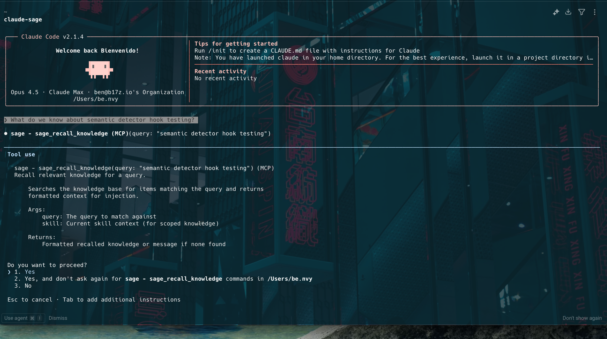

# Sage

**Stop losing context. Start checkpointing your AI research.**

Sage is a Claude Code plugin that gives your AI assistant memory across sessions. When you're deep in research or complex problem-solving, Sage helps Claude automatically save semantic checkpoints—capturing what matters (conclusions, tensions, discoveries) and discarding what doesn't (the meandering path to get there).

## The Problem

You're 2 hours into a research session with Claude. You've explored 15 sources, validated 3 hypotheses, found a critical disagreement between experts, and synthesized a thesis. Then:

- Context window fills up → auto-compaction loses your nuanced findings
- You close the session → tomorrow you start from scratch
- You switch projects → that research thread is orphaned

**The result:** You become the orchestration layer, manually maintaining state across fragmented chat sessions like a conspiracy board.

## The Solution

Sage teaches Claude to checkpoint proactively—not when tokens run out, but when something meaningful happens:

- Hypothesis validated or invalidated
- Critical constraint discovered
- Synthesis moment ("putting this together...")
- Branch point ("we could either X or Y")
- You say "checkpoint" or "save this"

Each checkpoint captures:
- **Core question** — What decision is this driving toward?
- **Thesis + confidence** — Your current synthesized position
- **Open questions** — What's still unknown
- **Sources** — Decision-relevant summaries (not full content)
- **Tensions** — Where credible sources disagree (high value!)
- **Unique contributions** — What YOU discovered, not just aggregated

## Features

### Auto-Checkpoint (MCP Server)
Claude automatically saves checkpoints when meaningful events occur:
- **After web searches** — Captures synthesized findings before they're lost
- **On synthesis moments** — When Claude combines multiple sources into a conclusion  
- **Before context compaction** — PreCompact hook ensures nothing is lost to auto-compact
- **On explicit request** — Say "checkpoint" anytime

### Knowledge Persistence
Store and recall facts across sessions:
- `sage_save_knowledge` — Persist discoveries, constraints, validated facts
- `sage_recall_knowledge` — Query your knowledge base semantically
- Knowledge survives context resets and session restarts

### Semantic Recall (Optional)
Install embeddings support for smarter knowledge matching:
```bash
pip install claude-sage[embeddings]  # ~2GB for model + torch
```
- **Model:** `all-MiniLM-L6-v2` (~80MB, runs locally on CPU)
- **70% semantic + 30% keyword** — Combined scoring for best of both worlds
- **Checkpoint deduplication** — Skips saving when thesis is 90%+ similar to recent checkpoint
- **Graceful fallback** — Works without embeddings, just uses keyword matching

### Smart Thresholds
Auto-checkpoint uses configurable confidence thresholds per trigger type:
- `synthesis: 0.5` — Save after strong synthesis moments
- `web_search_complete: 0.3` — Save after research with findings
- `precompact: 0.0` — Always save before context compaction
- `explicit: 0.0` — Always save on user request

## Quick Start (5 minutes)

### 1. Install

**Option A: Claude Code Plugin (recommended)**
```
/plugin marketplace add b17z/sage
/plugin install sage@sage-marketplace
```

**Option B: PyPI**
```bash
pip install claude-sage
sage mcp install
sage hooks install
```

**Option C: From source**
```bash
git clone https://github.com/b17z/sage.git
cd sage
pip install -e ".[mcp]"
sage mcp install
sage hooks install
```

### 2. Test it

```bash
# Start Claude Code
claude

# Have a conversation, ask for recommendations
# Watch for "Stop hook error: Synthesis detected..." - that's the hook working
# Claude will checkpoint automatically

# Later, in a new session:
sage checkpoint list
sage checkpoint show <checkpoint-id>
```

## What Works (MVP - January 2026)

### ✅ Tested and Working

**MCP Tools:**
- `sage_save_checkpoint` — Full checkpoint with thesis, sources, tensions
- `sage_load_checkpoint` — Restore checkpoint context
- `sage_list_checkpoints` — List all checkpoints
- `sage_autosave_check` — Auto-checkpoint with confidence thresholds
- `sage_save_knowledge` — Persist facts with keyword triggers
- `sage_recall_knowledge` — Auto-recall by keyword matching
- `sage_list_knowledge` — List knowledge items
- `sage_remove_knowledge` — Delete knowledge items

**Hooks:**
- Context threshold (70%) — Checkpoints before autocompact
- Semantic detector — Detects synthesis, branch_point, constraint, topic_shift
- Priority ordering — topic_shift > branch_point > constraint > synthesis
- Cooldown mechanism — 5-min per trigger type
- Meta-ban list — Prevents trigger loops on hook discussion

**CLI:**
- `sage checkpoint list/show/rm` — Manage checkpoints
- `sage knowledge add/list/match/rm` — Manage knowledge

### ⚠️ Current Scope: Research First

Sage is currently optimized for **research workflows** — web searches, synthesis, exploring options, validating hypotheses. The semantic patterns and checkpoint structure are tuned for knowledge work.

**Why research first?** Cause we were running into context limits very quickly in Claude UI when doing deep research. Once we nail research checkpointing, extending to code ("I just refactored this module", "Found the bug") is a natural next step.

### 🔧 Known Limitations (MVP)

1. **Tool-call awareness** — Should skip if `sage_autosave_check` already called this turn
2. **Pre-compact hook** — Exists but untested (Claude Code's `/compact` had internal errors)
3. **No code patterns** — Doesn't detect code-specific moments (refactors, bug fixes, architecture decisions)

### 📋 Future Work

- **Code checkpoint patterns** — Detect refactors, bug fixes, architecture decisions
- Context window tracker MCP tool
- Obsidian integration for checkpoint export
- Better cooldown (content hash, topic tracking)

## Prerequisites

- Python 3.11+
- [Claude Code](https://claude.ai/code) CLI
- jq (for hooks)

## Installation Options

### Full Install (recommended)

```bash
pip install claude-sage
sage mcp install
sage hooks install
```

### MCP Tools Only

See Quick Start above.

### Manual Hook Installation

If you prefer to install hooks manually (MCP server still required for checkpoint tools):

```bash
sage hooks install
# Or manually copy from .claude/hooks/ and update ~/.claude/settings.json
```

## Usage

### Automatic (Recommended)

Just work normally. Claude will recognize checkpoint-worthy moments and save state automatically. You'll see brief notifications like:

```
Stop hook error: Synthesis detected in your response. Call sage_autosave_check...
```

("Stop hook error" is cosmetic—it's how Claude Code displays hook instructions.)

### Manual

Say "checkpoint" or "save this" anytime:

```
You: checkpoint
Claude: [Extracts and saves semantic checkpoint]
        Saved: core question, thesis (confidence: 0.8), 3 open questions,
        5 sources, 1 tension, 2 unique discoveries
```

### Restore in New Session

```bash
# List checkpoints
sage checkpoint list

# Show full checkpoint
sage checkpoint show <checkpoint-id>
```

Or in Claude Code, just load it:
```
You: sage checkpoint show 2026-01-11T07-30-54
Claude: [Loads and displays full context]
```

### Keyword Auto-Recall

Knowledge items auto-inject when queries match keywords:

```
You: What do we know about semantic detector hook testing?
Claude: [Auto-recalls 195 tokens of stored knowledge]
        [Formats into structured response]
```



## What Gets Saved

Checkpoints live in `~/.sage/checkpoints/` (global, accessible from any project).

Example checkpoint (98% compression from 45,000 token conversation):

```yaml
checkpoint:
  id: 2026-01-10T14-30-00_payment-rails-synthesis

  core_question: |
    Where do stablecoins actually win vs traditional payment rails?

  thesis: |
    Integrate, don't replace. Stablecoins win middle-mile + new primitives,
    not POS checkout. Most companies have pieces but not packaging.
  confidence: 0.75

  open_questions:
    - What's the unified customer object strategy?
    - Timeline for Stripe's full stack vs current fragmentation?

  sources:
    - id: sheel_mohnot
      take: "No forcing function for stablecoin POS—every successful payment network had exclusivity or killer reward"
      relation: contradicts
    - id: simon_taylor
      take: "Not about price—about TAM expansion. Stablecoins enable payments that couldn't exist before"
      relation: nuances

  tensions:
    - between: [sheel_mohnot, sam_broner]
      nature: "Whether merchant profitability is sufficient forcing function"
      resolution: unresolved

  unique_contributions:
    - type: discovery
      content: "Platform team didn't know about existing SDK integration possibilities"
```

## Architecture

Sage is built as a multi-platform plugin:

```
sage/
├── skills/checkpoint/       # Core skill (works across platforms)
├── sage/mcp_server.py       # MCP server for auto-checkpoint
├── .claude-plugin/          # Claude Code adapter
├── hooks/                   # Claude Code hooks
├── commands/                # Slash commands
├── WARP.md                  # Warp adapter
└── docs/                    # Methodology documentation
```

Future adapters can be added for Codex, Gemini, etc. The core checkpoint methodology remains shared.

## Why "Semantic" Checkpointing?

Traditional approaches compress reactively (when tokens run out) and lossily (summarizing everything equally).

Semantic checkpointing is:
- **Proactive** — Triggered by state transitions, not token pressure
- **Selective** — Preserves high-value signals (tensions, discoveries), drops low-value (tangents, process chatter)
- **Decision-oriented** — Organized around the question being answered, not chronology

The compression test: *"If I only had this checkpoint, could I make the same decision I would with the full conversation?"*

## Documentation

- [Checkpoint Methodology](docs/checkpoint.md) — Full framework for semantic checkpointing
- [Design Doc](docs/design-knowledge-checkpoints.md) — Implementation details and future roadmap
- [MCP Design](docs/design-mcp-autocheckpoint.md) — MCP server architecture for auto-checkpoint

## License

MIT
