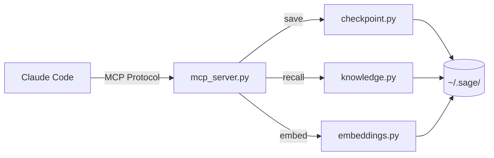
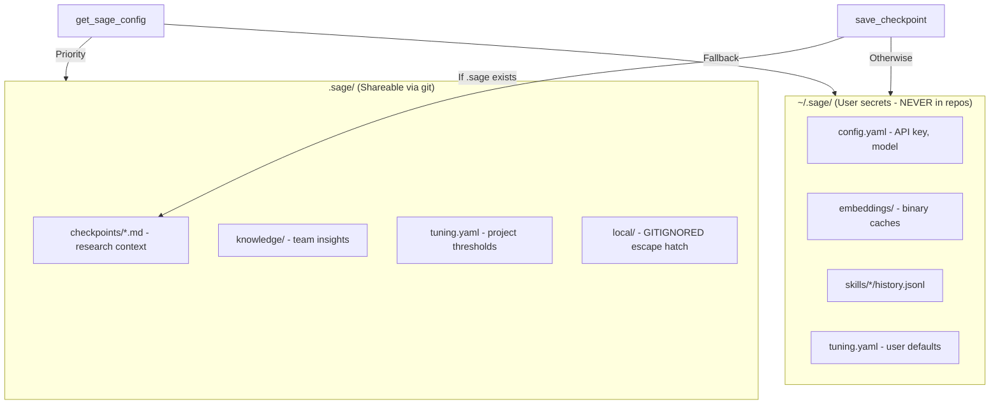
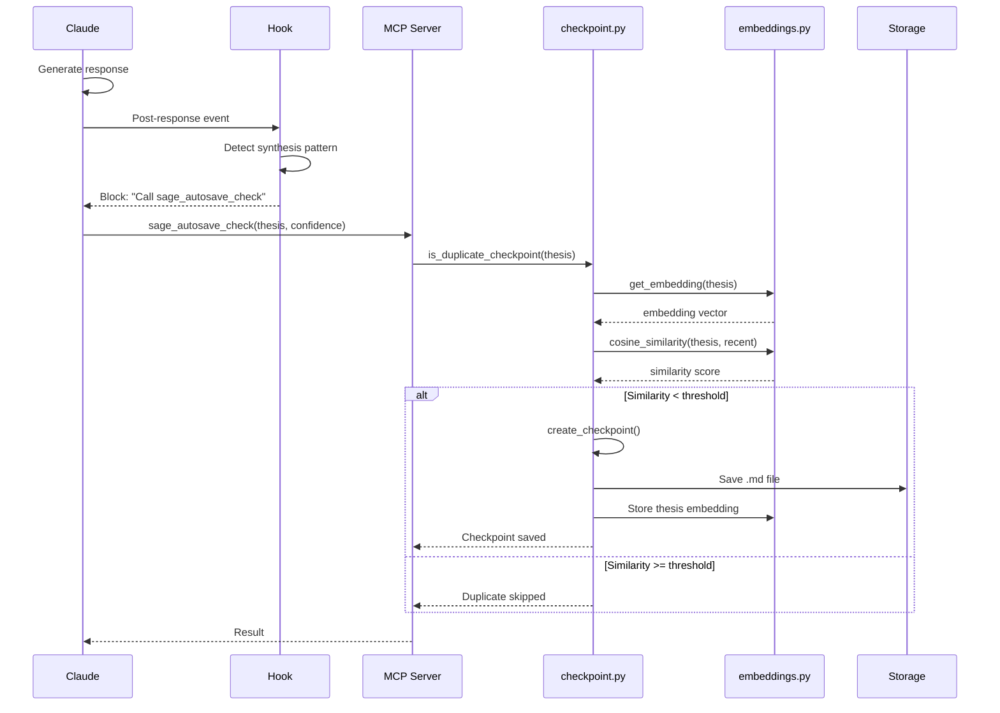
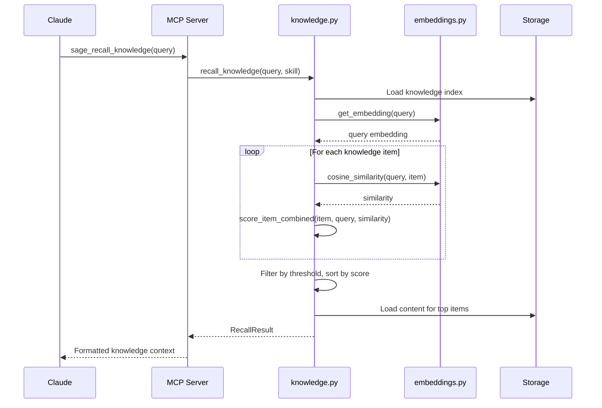
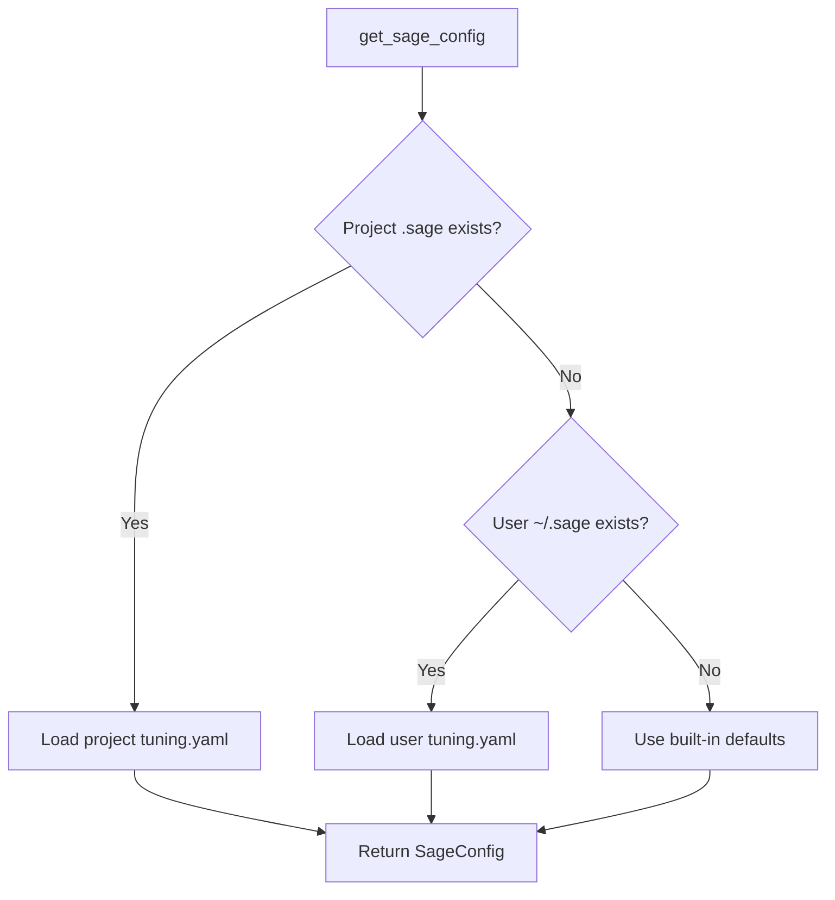

# Sage Architecture

System design and data flow for the Sage semantic checkpointing system.

## Overview

Sage is a Claude Code plugin that provides semantic memory across sessions. It consists of three main integration points:

1. **MCP Server** — Tools Claude can call to save/load checkpoints and knowledge
2. **Hooks** — Bash scripts that detect checkpoint-worthy moments
3. **CLI** — Command-line interface for managing checkpoints and knowledge

```
┌─────────────────────────────────────────────────────────────────────┐
│                          Claude Code                                 │
├─────────────────────────────────────────────────────────────────────┤
│                                                                     │
│  ┌──────────────┐    ┌──────────────┐    ┌──────────────┐         │
│  │    Hooks     │    │  MCP Server  │    │     CLI      │         │
│  │  (bash/jq)   │    │  (Python)    │    │   (Click)    │         │
│  └──────┬───────┘    └──────┬───────┘    └──────┬───────┘         │
│         │                   │                   │                  │
│         │ Detect triggers   │ Save/load         │ Manage           │
│         │                   │                   │                  │
│         └───────────────────┼───────────────────┘                  │
│                             │                                       │
│                             ▼                                       │
│                    ┌────────────────┐                              │
│                    │   Sage Core    │                              │
│                    │  checkpoint.py │                              │
│                    │  knowledge.py  │                              │
│                    │  embeddings.py │                              │
│                    │   config.py    │                              │
│                    └────────┬───────┘                              │
│                             │                                       │
│                             ▼                                       │
│                    ┌────────────────┐                              │
│                    │   ~/.sage/     │                              │
│                    │  .sage/ (local)│                              │
│                    └────────────────┘                              │
│                                                                     │
└─────────────────────────────────────────────────────────────────────┘
```

## Component Architecture

### MCP Server (`sage/mcp_server.py`)

The MCP server exposes tools to Claude:



**Tools exposed:**

| Tool | Module | Purpose |
|------|--------|---------|
| `sage_save_checkpoint` | checkpoint.py | Create checkpoint |
| `sage_load_checkpoint` | checkpoint.py | Restore checkpoint |
| `sage_list_checkpoints` | checkpoint.py | List checkpoints |
| `sage_autosave_check` | checkpoint.py | Auto-checkpoint with dedup |
| `sage_save_knowledge` | knowledge.py | Store knowledge item |
| `sage_recall_knowledge` | knowledge.py | Query knowledge base |
| `sage_list_knowledge` | knowledge.py | List knowledge items |
| `sage_remove_knowledge` | knowledge.py | Delete knowledge item |

### Hooks (`.claude/hooks/`)

Bash scripts that run on Claude Code events:

```mermaid
flowchart TD
    Response[Claude Response] --> PostResponse{Post-Response Hooks}
    PostResponse -->|Check patterns| Semantic[semantic-detector.sh]
    PostResponse -->|Check tokens| Context[context-check.sh]

    Semantic -->|Synthesis detected| Block1[Block: Request checkpoint]
    Context -->|>70% context| Block2[Block: Request checkpoint]

    Compact[/compact Command] --> PreCompact{Pre-Compact Hook}
    PreCompact -->|Manual| Block3[Block: Request checkpoint]
    PreCompact -->|Auto| Approve[Approve: Prevent deadlock]
```

**Hook files:**

| Hook | Event | Purpose |
|------|-------|---------|
| `post-response-semantic-detector.sh` | Stop | Detect synthesis, branch points, constraints |
| `post-response-context-check.sh` | Stop | Trigger checkpoint at token threshold |
| `pre-compact.sh` | PreCompact | Checkpoint before manual compact |

### Storage Layer

Sage uses a split storage model for security:



**Security principle:** Secrets (`config.yaml` with API key) stay in `~/.sage/`. Shareable data (checkpoints, knowledge, tuning) goes in project `.sage/`.

## Data Flow

### Checkpoint Creation Flow



### Knowledge Recall Flow



## File Structure

```
~/.sage/                          # User-level (NEVER in git repos)
├── config.yaml                   # API key, model prefs (SECRETS!)
├── tuning.yaml                   # User-level threshold defaults
├── shared_memory.md              # Cross-skill shared context
├── embeddings/                   # Binary embedding caches
│   ├── knowledge.npy             # Knowledge embeddings
│   ├── knowledge.json            # Knowledge IDs
│   ├── checkpoints.npy           # Checkpoint thesis embeddings
│   └── checkpoints.json          # Checkpoint IDs
└── skills/<name>/                # Skill metadata
    └── history.jsonl             # Interaction history (private)

~/.claude/skills/                 # Skill definitions (Agent Skills standard)
└── <name>/
    ├── SKILL.md                  # System prompt + YAML frontmatter
    └── docs/                     # Reference materials

<project>/.sage/                  # Project-level (shareable via git)
├── tuning.yaml                   # Project-specific thresholds
├── checkpoints/                  # Research checkpoints (team context)
│   ├── 2026-01-16T12-00-00_*.md  # Markdown + frontmatter
│   └── ...
├── knowledge/                    # Knowledge base (team insights)
│   ├── index.yaml                # Knowledge registry
│   ├── global/                   # Global knowledge items
│   │   └── *.md                  # Markdown + frontmatter
│   └── skills/<name>/            # Skill-scoped knowledge
└── local/                        # GITIGNORED - project-local overrides
    └── ...                       # User-specific project data
```

**Note:** `.sage/local/` is gitignored for user-specific project data that shouldn't be shared.

## Module Responsibilities

| Module | Purpose |
|--------|---------|
| `checkpoint.py` | Checkpoint CRUD, markdown serialization, deduplication |
| `knowledge.py` | Knowledge storage, hybrid retrieval, scoring |
| `embeddings.py` | Embedding generation, similarity search, vector storage |
| `config.py` | Config management, project detection, path resolution |
| `mcp_server.py` | MCP tool definitions, Claude interface |
| `cli.py` | Command-line interface (Click) |
| `client.py` | Anthropic API client with streaming |
| `skill.py` | Skill loading, context building |
| `errors.py` | Result types (Ok/Err), error constructors |

## Configuration Cascade

Config resolution follows project → user → default priority:



## Security Considerations

See [Security Checklist](security-deserialization-checklist.md) for full details.

**Key practices:**
- `yaml.safe_load()` for all YAML parsing
- `np.load(allow_pickle=False)` for embeddings
- Path sanitization to prevent directory traversal
- No `eval()`, `pickle.load()`, or `exec()`

## Extension Points

### Adding New Triggers

1. Add pattern to `post-response-semantic-detector.sh`
2. Add confidence threshold to `mcp_server.py`
3. Update priority ordering if needed

### Adding New MCP Tools

1. Define tool in `mcp_server.py` using `@mcp.tool()`
2. Implement logic in appropriate module
3. Add tests

### Supporting New Storage Backends

The storage layer is abstracted through:
- `get_checkpoints_dir()` — Returns appropriate directory
- `get_sage_config()` — Resolves config cascade
- `detect_project_root()` — Finds project boundaries

Override these to support alternative backends (S3, database, etc.).
